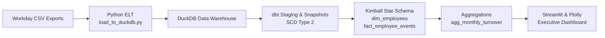
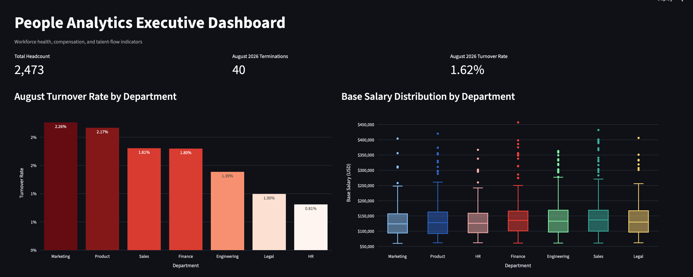
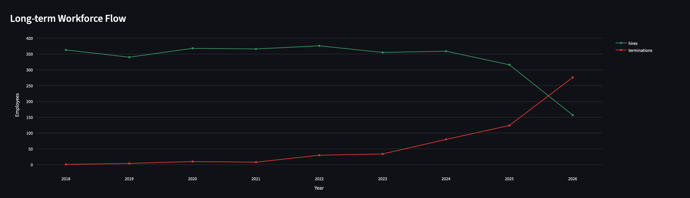

# People Analytics DWH & Executive BI Pipeline

An end-to-end People Analytics portfolio project that turns simulated Workday HCM extracts into a tested, historical data warehouse and executive dashboard.

The stack combines **Python ELT**, **DuckDB**, **dbt Core** with **SCD Type 2** snapshots, and a **Streamlit + Plotly** executive BI experience. It is designed to answer a deceptively difficult workforce question reliably: *what was the organization’s headcount at a particular point in time, and what was the corresponding turnover rate?*

## Business problem: denominator alignment

Turnover is only meaningful when termination events and the headcount denominator refer to the same reporting period. Current-state employee extracts alone cannot answer historical headcount questions after employees have changed departments, been promoted, or terminated.

This pipeline solves that denominator alignment problem with dbt SCD Type 2 employee snapshots. Each employee version is bounded by `dbt_valid_from` and `dbt_valid_to`, enabling monthly headcount calculations against the employee state valid at each reporting boundary. The event fact supplies dated hires and terminations; the turnover aggregation combines those events with the correctly aligned historical denominator.

## Architecture and lineage



## Dashboard preview

Add the supplied dashboard captures to `assets/` using the filenames below.





## Data model

| Table | Grain | Purpose |
| --- | --- | --- |
| `dim_employees` | One row per employee SCD version | Historical employee attributes and SCD validity windows, including department, job level, compensation, and employment status. |
| `fact_employee_events` | One row per Workday HR transaction | Dated hires, promotions, transfers, compensation changes, and terminations linked to employee context. |
| `agg_monthly_turnover` | One row per reporting month and department | Beginning/ending headcount, terminations, and turnover rate for executive reporting. |

### Data quality

The pipeline is validated with **21 passing dbt tests**, covering `unique`, `not_null`, `accepted_values`, relationships, and custom/composite key combinations. These checks protect the natural and surrogate keys, mandatory reporting fields, valid event categories, and the month-department reporting grain.

## Project structure

```text
.
├── generate_workday_hr_data.py       # Generates simulated employee extracts and HR events
├── load_to_duckdb.py                 # Incrementally appends dated CSV batches to DuckDB
├── people_analytics.duckdb           # Local warehouse (ignored by Git)
├── people_analytics_dbt/
│   ├── models/staging/                # Source declarations and cleaned staging models
│   ├── models/marts/                  # Dimension, fact, and turnover aggregation models
│   └── snapshots/                     # Employee SCD Type 2 snapshot
├── app.py                             # Streamlit + Plotly executive dashboard
└── assets/                            # Dashboard screenshots
```

## Quickstart and reproducibility

### 1. Clone and install dependencies

```bash
git clone https://github.com/allison-yc/people-analytics-dbt-pipeline.git
cd people-analytics-dbt-pipeline
pip install -r requirements.txt
```

### 2. Configure the dbt profile

Ensure `~/.dbt/profiles.yml` points the `people_analytics_dbt` profile to the repository’s local warehouse:

```yaml
people_analytics_dbt:
  target: dev
  outputs:
    dev:
      type: duckdb
      path: ./people_analytics.duckdb
      threads: 1
```

### 3. Generate and load incremental batches

Create and load the initial extract:

```bash
python generate_workday_hr_data.py --batch month_1
python load_to_duckdb.py --batch month_1
```

Create the initial SCD history before loading the next extract:

```bash
dbt snapshot --project-dir people_analytics_dbt
```

Generate and append the next dated extract:

```bash
python generate_workday_hr_data.py --batch month_2
python load_to_duckdb.py --batch month_2
```

### 4. Build and validate dbt models

```bash
dbt snapshot --project-dir people_analytics_dbt
dbt run --project-dir people_analytics_dbt
dbt test --project-dir people_analytics_dbt
```

### 5. Launch the executive dashboard

```bash
streamlit run app.py
```

The dashboard provides executive KPIs, departmental turnover analysis, salary distribution, and long-term workforce-flow trends.

## Notes

- DuckDB is local and file based, so `people_analytics.duckdb` is intentionally excluded from version control.
- The raw loader protects against accidental duplicate batch loads using `extract_date`.
- Run snapshots after each newly loaded employee extract to retain SCD Type 2 history.
